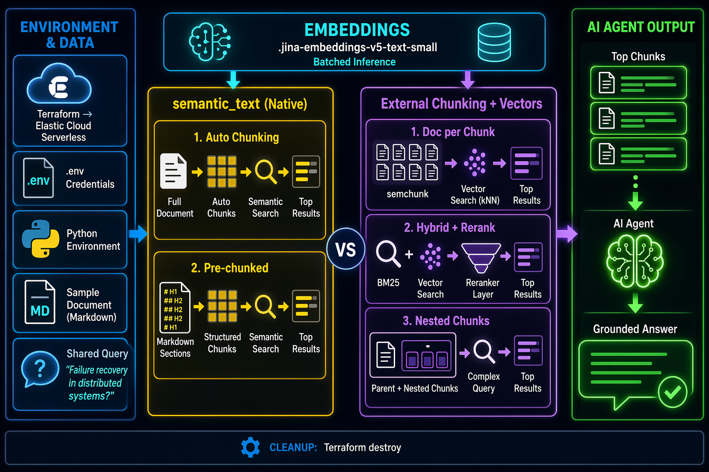
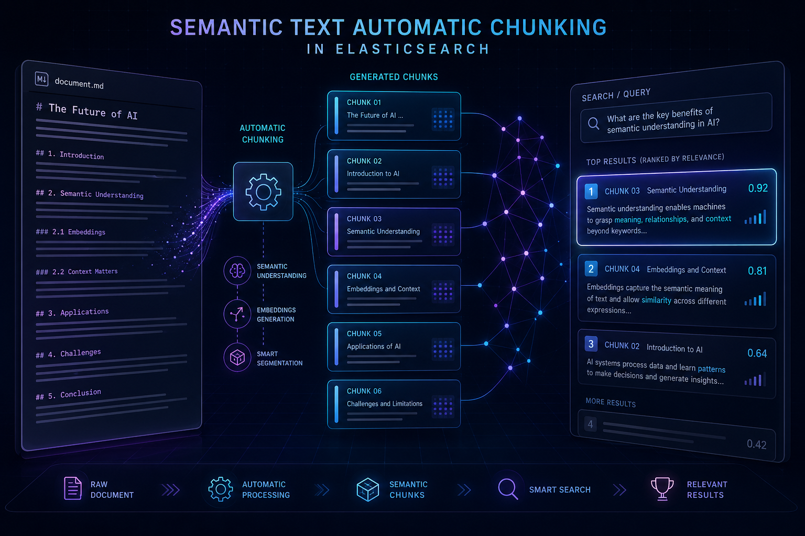
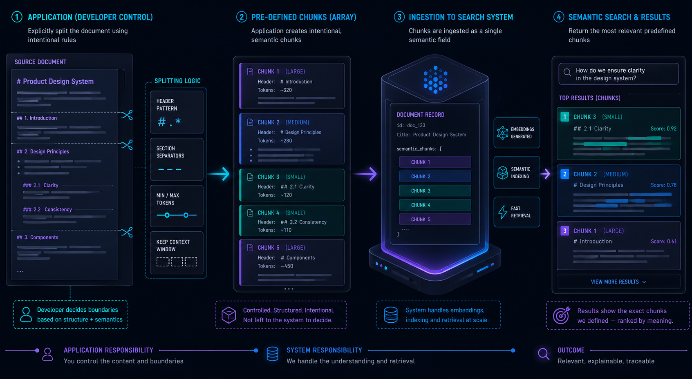
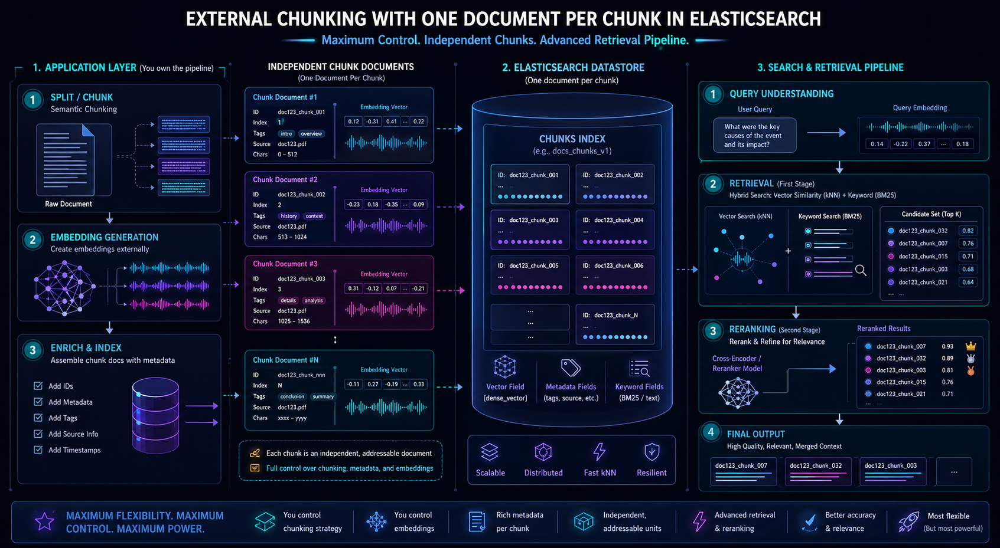
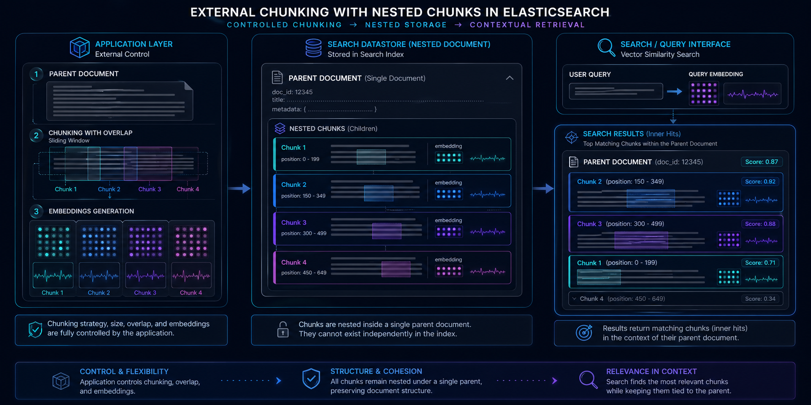

# Elasticsearch Chunking for Agentic AI: Choosing the Right Strategy
*The chunking strategy you pick determines what your agents see — and how well they reason.*

Document chunking is the process of breaking down large documents into smaller segments before they are converted to vectors and stored in a database.  This process aids an agent performing search against that database by pinpointing the exact excerpt of that document needed to answer a query.  The alternative would be creating a vector of the entire document.  In that scenario, important details get washed out by the surrounding context.  Net, an effective chunking strategy increases the signal to noise ratio of the context delivered to an agent.

---

## What This Article Covers

- Provisioning an [Elastic Serverless](https://www.elastic.co/cloud/serverless) project via Terraform.
- Execution of four different chunking w/search strategies.
    - Automatic chunking via [semantic_text](https://www.elastic.co/docs/reference/elasticsearch/mapping-reference/semantic-text) field type
    - Pre-chunking to arrays with semantic_text
    - External chunking - one chunk per document. 
    - External chunking - all chunks stored in the same parent document
    
---

## Architecture
- All Python and Bash logic is executed from a Jupyter notebook.
- Elastic Serverless is used as the vector platform for this demo.  All provisioning is done via Terraform.
- One sample markdown document (sample_doc.md) is used for all the strategy examples.
- Index mappings and query logic are tailored for each strategy.



---

## Semantic Text — Automatic Chunking

### Ingest
This example creates an Elasticsearch index with a single `semantic_text` field for the entire document.  Below is the mapping:
```python
S1_INDEX = "scenario1"
scenario1_mapping = {
    "mappings": {
        "properties": {
            "content": { 
                "type": "semantic_text",
                 "chunking_settings": {
                     "strategy": "recursive",
                     "max_chunk_size": 200,
                     "separator_group": "markdown"
                 } 
            }
        }
    }
}

es.indices.create(index=S1_INDEX, body=scenario1_mapping)
es.index(index=S1_INDEX, id=1, document={"content": doc_content})
```
- Note that I override the default `chunking_settings` with a strategy honed to markdown documents.  With the [`recursive`](https://www.elastic.co/docs/explore-analyze/elastic-inference/inference-api#recursive) strategy, chunks are aligned to markdown headings.  The default chunking strategy, [`sentence`](https://www.elastic.co/docs/explore-analyze/elastic-inference/inference-api#sentence), is below.
```python
"chunking_settings": {
  "strategy": "sentence",
  "max_chunk_size": 250,
  "sentence_overlap": 1
}
```
- Since I didn't specify an inference endpoint here, the [default](https://www.elastic.co/docs/reference/elasticsearch/mapping-reference/semantic-text-setup-configuration#default-endpoints) is used.  In this case, that is [.jina-embeddings-v5-text-small](https://huggingface.co/jinaai/jina-embeddings-v5-text-small) and runs on [Elastic Inference Service](https://www.elastic.co/docs/explore-analyze/elastic-inference/eis) (EIS).

**Chunks**
```text
ES auto-chunked into 18 chunks:
  Chunk 0: 62 words — # Building Resilient Distributed Systems  Modern software sy...
  Chunk 1: 199 words —  ## Foundations of Distribution  ### Why Distribute?  There ...
  Chunk 2: 138 words —  ### The Fallacies of Distributed Computing  In 1994, Peter ...
  Chunk 3: 108 words —  ## Consensus and Coordination  ### The Role of Consensus  M...
  Chunk 4: 174 words —  ### Leader Election  Leader election is one of the most com...
  Chunk 5: 166 words —  ### Distributed Locks and Fencing Tokens  Distributed locks...
  Chunk 6: 110 words —  ## Data Replication Strategies  ### Single-Leader Replicati...
  Chunk 7: 101 words —  ### Multi-Leader Replication  Multi-leader replication allo...
  Chunk 8: 110 words —  ### Leaderless Replication  Leaderless replication, popular...
  Chunk 9: 120 words —  ## Handling Failure  ### Failure Detection  Before a system...
  Chunk 10: 141 words —  ### Circuit Breakers and Bulkheads  Circuit breakers preven...
  Chunk 11: 143 words —  ### Retries and Idempotency  Retries are the most basic fai...
  Chunk 12: 121 words —  ## Scaling Patterns  ### Vertical vs. Horizontal Scaling  V...
  Chunk 13: 157 words —  ### Partitioning and Sharding  When a dataset outgrows a si...
  Chunk 14: 123 words —  ### Caching Strategies  Caching reduces load on backend sys...
  Chunk 15: 147 words —  ## Observability in Distributed Systems  ### Distributed Tr...
  Chunk 16: 130 words —  ### Structured Logging  Traditional unstructured log lines ...
  Chunk 17: 177 words —  ### Health Checks and SLOs  Health checks expose the status...
```
### Search
Chunks are stored in an internal data structure for each document.  A search yields the entire document, but you can access the chunks of that document in relevance order via [highlight](https://www.elastic.co/docs/reference/elasticsearch/rest-apis/highlighting).
```python
QUERY = "How do distributed systems handle failures and recovery?"
response = es.search(
    index=S1_INDEX,
    body={
        "query": {
            "semantic": {
                "field": "content",
                "query": QUERY,
            }
        },
        "_source": False,
        "highlight": {
            "fields": {
                "content": {
                    "type": "semantic",
                    "number_of_fragments": 5,
                    "order": "score",
                }
            }
        },
        "size": 5
    },
)
```
**Results**
```text
Query: How do distributed systems handle failures and recovery?
Search Results (with semantic highlighting, in order of relevance)
  Score: 0.8272
    Chunk:## Handling Failure  ### Failure Detection  Before a system can respond to a failure, it must detec...
    Chunk:# Building Resilient Distributed Systems  Modern software systems rarely live on a single machine. A...
    Chunk:## Foundations of Distribution  ### Why Distribute?  There are three primary reasons to distribute...
    Chunk:### The Fallacies of Distributed Computing  In 1994, Peter Deutsch and others at Sun Microsystems a...
    Chunk:### Leaderless Replication  Leaderless replication, popularized by Amazon's Dynamo paper and used i...
```

### Appraisal 
**Pros:**
- Simplest implementation — index raw text and ES handles chunking and embedding automatically
- Zero pipeline overhead — no external chunking libraries or embedding infrastructure needed
- Semantic highlighting retrieves the most relevant chunks, ranked by similarity
- Embedding model is configurable via `inference_id` in the field mapping
- Chunking is configurable via `chunking_settings` — control strategy, max chunk size, and overlap
- Compatible with hybrid search — combine [semantic](https://www.elastic.co/docs/reference/query-languages/query-dsl/query-dsl-semantic-query) queries with BM25 [match](https://www.elastic.co/docs/reference/query-languages/query-dsl/query-dsl-match-query) queries in compound retrievers

**Cons:**
- No per-chunk metadata — can't attach section headers, tags, or filters to individual chunks
- Chunks are internal to the document — can't independently update or delete a single chunk without reindexing

**Good fit for:**
- Rapid prototyping — a working semantic search pipeline in minutes with no external dependencies
- Teams without dedicated ML ops who want vector search out of the box

---

## Semantic Text — Pre-chunked Arrays

### Ingest
In this scenario, I disable automatic chunking in `semantic_text` with a strategy of [none](https://www.elastic.co/docs/explore-analyze/elastic-inference/inference-api#none).  I pre-chunk the document with a regex function and then store those chunks in an array.  That array is then put into the `semantic_text` field.  Note that embeddings are still automatically handled here.
```python
S2_INDEX = "scenario2"
scenario2_mapping = {
    "mappings": {
        "properties": {
            "content": { 
                "type": "semantic_text",
                 "chunking_settings": {
                     "strategy": "none"
                 } 
            }
        }
    }
}

chunks = re.split(r'(?=^#{1,3} )', doc_content, flags=re.MULTILINE)
chunks = [c.strip() for c in chunks if c.strip()]
es.indices.create(index=S2_INDEX, body=scenario2_mapping)
es.index(index=S2_INDEX, document={"content": chunks})
```
**Chunks**
```text
Chunk count: 24
  Chunk 0: 62 words — # Building Resilient Distributed Systems  Modern software sy...
  Chunk 1: 4 words — ## Foundations of Distribution...
  Chunk 2: 195 words — ### Why Distribute?  There are three primary reasons to dist...
  Chunk 3: 138 words — ### The Fallacies of Distributed Computing  In 1994, Peter D...
  Chunk 4: 4 words — ## Consensus and Coordination...
  Chunk 5: 104 words — ### The Role of Consensus  Many distributed problems reduce ...
  Chunk 6: 174 words — ### Leader Election  Leader election is one of the most comm...
  Chunk 7: 166 words — ### Distributed Locks and Fencing Tokens  Distributed locks ...
  Chunk 8: 4 words — ## Data Replication Strategies...
  Chunk 9: 106 words — ### Single-Leader Replication  In single-leader replication,...
  Chunk 10: 101 words — ### Multi-Leader Replication  Multi-leader replication allow...
  Chunk 11: 110 words — ### Leaderless Replication  Leaderless replication, populari...
  Chunk 12: 3 words — ## Handling Failure...
  Chunk 13: 117 words — ### Failure Detection  Before a system can respond to a fail...
  Chunk 14: 141 words — ### Circuit Breakers and Bulkheads  Circuit breakers prevent...
  Chunk 15: 143 words — ### Retries and Idempotency  Retries are the most basic fail...
  Chunk 16: 3 words — ## Scaling Patterns...
  Chunk 17: 118 words — ### Vertical vs. Horizontal Scaling  Vertical scaling means ...
  Chunk 18: 157 words — ### Partitioning and Sharding  When a dataset outgrows a sin...
  Chunk 19: 123 words — ### Caching Strategies  Caching reduces load on backend syst...
  Chunk 20: 5 words — ## Observability in Distributed Systems...
  Chunk 21: 142 words — ### Distributed Tracing  In a monolithic application, a stac...
  Chunk 22: 130 words — ### Structured Logging  Traditional unstructured log lines —...
  Chunk 23: 177 words — ### Health Checks and SLOs  Health checks expose the status ...
```
### Search
I use the same query as the previous scenario with `highlight` leveraged to obtain individual chunks ordered by relevance.
```python
QUERY = "How do distributed systems handle failures and recovery?"
response = es.search(
    index=S2_INDEX,
    body={
        "query": {
            "semantic": {
                "field": "content",
                "query": QUERY,
            }
        },
        "_source": False,
        "highlight": {
            "fields": {
                "content": {
                    "type": "semantic",
                    "number_of_fragments": 5,
                    "order": "score"
                }
            }
        },
        "size": 5
    },
)
```

**Results**
```text
Query: How do distributed systems handle failures and recovery?
Search Results (with semantic highlighting)
  Score: 0.8147
    Chunk: # Building Resilient Distributed Systems  Modern software systems rarely live on a single machine. A...
    Chunk: ### Failure Detection  Before a system can respond to a failure, it must detect one. In a distribute...
    Chunk: ### Why Distribute?  There are three primary reasons to distribute a system: capacity, availability,...
    Chunk: ### The Fallacies of Distributed Computing  In 1994, Peter Deutsch and others at Sun Microsystems ar...
    Chunk: ## Observability in Distributed Systems...
```

### Appraisal

**Pros:**
- Application controls exact chunk boundaries — split on any logic (headers, paragraphs, semantic units)
- ES still manages inference — no need to run embedding models locally
- Same simple `semantic_text` field mapping as Scenario 1 — no [dense_vector](https://www.elastic.co/docs/reference/elasticsearch/mapping-reference/dense-vector) or custom pipeline needed
- Semantic highlighting retrieves the most relevant chunks from your pre-defined boundaries

**Cons:**
- Still no per-chunk metadata — can't attach tags or filters to individual array elements
- Chunks are still internal to the document — can't independently update or delete a single chunk
- Application is responsible for chunking quality — bad splits produce bad retrieval
- Each array element must fit within the inference model's token limit

**Good fit for:**
- Documents with clear structural boundaries (markdown headers, HTML sections, paragraphs) where you want to preserve them
- When you need chunking control but don't want to manage embedding infrastructure

---

## External Chunking — One Document Per Chunk

### Ingest
For this scenario, I need to manage both chunking and embeddings client-side as `semantic_text` is not used.  I use the [semchunk](https://github.com/isaacus-dev/semchunk) Python library to semantically split the document into coherent chunks.  I then use the Elastic [Inference API](https://www.elastic.co/docs/api/doc/elasticsearch/operation/operation-inference-inference) to embed each chunk via `.jina-embeddings-v5-text-small` - the same model used in the previous two examples.

```python
from semchunk import chunk

EMBEDDING_MODEL = ".jina-embeddings-v5-text-small"
token_counter = lambda text: len(text.split())

S3_INDEX = "scenario3"
scenario3_mapping = {
    "mappings": {
        "properties": {
            "parent_id": { "type": "keyword" },
            "chunk_index": { "type": "integer" },
            "chunk_text": { "type": "text" },
            "embedding": {
                "type": "dense_vector",
                "dims": 1024,
                "index": True,
                "similarity": "cosine",
                "index_options": { "type": "int8_hnsw" }
            }
        }
    }
}

chunks = chunk(doc_content, chunk_size=200, token_counter=token_counter)
embeddings = []
for batch_start in range(0, len(chunks), 16):
    batch = chunks[batch_start:batch_start + 16]
    result = es.inference.inference(
        inference_id=EMBEDDING_MODEL,
        task_type="text_embedding",
        body={"input": batch}
    )
    embeddings.extend(item["embedding"] for item in result["text_embedding"])

for i, (c, emb) in enumerate(zip(chunks, embeddings)):
    es.index(index=S3_INDEX, document={
        "parent_id": "sample_doc",
        "chunk_index": i,
        "chunk_text": c,
        "embedding": emb
    })
```
**Chunks**
```text
Chunk count: 15
  Chunk 0: 139 words — # Building Resilient Distributed Systems  Modern software sy...
  Chunk 1: 167 words — Availability is the second driver. A single machine is a sin...
  Chunk 2: 145 words — 1. The network is reliable. 2. Latency is zero. 3. Bandwidth...
  Chunk 3: 173 words — The FLP impossibility result, published by Fischer, Lynch, a...
  Chunk 4: 166 words — Protocols like Raft and Paxos solve this by requiring a quor...
  Chunk 5: 170 words — Fencing tokens mitigate this problem. Each time a lock is gr...
  Chunk 6: 170 words — Multi-leader replication allows multiple nodes to accept wri...
  Chunk 7: 163 words — This model offers high availability and tolerates individual...
  Chunk 8: 194 words — Circuit breakers prevent a failing downstream dependency fro...
  Chunk 9: 146 words — Idempotency is the complementary requirement. When a client ...
  Chunk 10: 175 words — Horizontal scaling means adding more nodes. It requires the ...
  Chunk 11: 173 words — Rebalancing — moving partitions between nodes as the cluster...
  Chunk 12: 142 words — In a monolithic application, a stack trace shows the full ex...
  Chunk 13: 132 words — Traditional unstructured log lines — free-text strings writt...
  Chunk 14: 172 words — Health checks expose the status of a service to load balance...
```
### Search - Query 1
Semantic_text is no longer managing query embedding either.  I have to do that manually via the [Inference API](https://www.elastic.co/docs/api/doc/elasticsearch/operation/operation-inference-inference).  I then use a [kNN](https://www.elastic.co/docs/solutions/search/vector/knn) query with that embedding to find the most relevant chunk documents.
```python
QUERY = "How do distributed systems handle failures and recovery?"
query_result = es.inference.inference(
    inference_id=EMBEDDING_MODEL,
    task_type="text_embedding",
    body={"input": [QUERY]}
)
query_embedding = query_result["text_embedding"][0]["embedding"]

response = es.search(
    index=S3_INDEX,
    body={
        "knn": {
            "field": "embedding",
            "query_vector": query_embedding,
            "k": 5,
            "num_candidates": 20
        },
        "size": 5
    }
)
```
**Results**
```text
Query: How do distributed systems handle failures and recovery?
Search Results
  Score: 0.8321  Chunk #: 7
  Chunk: This model offers high availability and tolerates individual...
  ---
  Score: 0.8024  Chunk #: 0
  Chunk: # Building Resilient Distributed Systems  Modern software sy...
  ---
  Score: 0.7957  Chunk #: 1
  Chunk: Availability is the second driver. A single machine is a sin...
  ---
  Score: 0.7740  Chunk #: 2
  Chunk: 1. The network is reliable. 2. Latency is zero. 3. Bandwidth...
  ---
  Score: 0.7685  Chunk #: 4
  Chunk: Protocols like Raft and Paxos solve this by requiring a quor...
```
### Search - Query 2
Here I use the Elasticsearch retriever API to combine a BM25 [match](https://www.elastic.co/docs/reference/query-languages/query-dsl/query-dsl-match-query) query on `chunk_text` with a kNN vector search on `embedding` via a [linear retriever](https://www.elastic.co/docs/reference/elasticsearch/rest-apis/retrievers/linear-retriever) (weighted 0.3 BM25 / 0.7 vector), then rerank the merged results using a [text_similarity_reranker](https://www.elastic.co/docs/reference/elasticsearch/rest-apis/retrievers/text-similarity-reranker-retriever) with the [.jina-reranker-v3](https://jina.ai/models/jina-reranker-v3/) inference endpoint. This is using the same index to demonstrate hybrid retrieval and reranking.

```python
RERANK_MODEL = ".jina-reranker-v3"

response = es.options(request_timeout=120).search(
    index=S3_INDEX,
    body={
        "retriever": {
            "text_similarity_reranker": {
                "retriever": {
                    "linear": {
                        "retrievers": [
                            {
                                "retriever": {
                                    "standard": {
                                        "query": {
                                            "match": {
                                                "chunk_text": QUERY
                                            }
                                        }
                                    }
                                },
                                "weight": 0.3
                            },
                            {
                                "retriever": {
                                    "knn": {
                                        "field": "embedding",
                                        "query_vector": query_embedding,
                                        "k": 10,
                                        "num_candidates": 20
                                    }
                                },
                                "weight": 0.7
                            }
                        ]
                    }
                },
                "field": "chunk_text",
                "inference_id": RERANK_MODEL,
                "inference_text": QUERY
            }
        },
        "size": 5
    },
)
```

**Results**
```text
Query: How do distributed systems handle failures and recovery?
Search Results (Hybrid: Linear + Reranking)
  Score: 1.2116  Chunk #: 7
  Chunk: This model offers high availability and tolerates individual...
  ---
  Score: 1.1384  Chunk #: 8
  Chunk: Circuit breakers prevent a failing downstream dependency fro...
  ---
  Score: 1.0229  Chunk #: 2
  Chunk: 1. The network is reliable. 2. Latency is zero. 3. Bandwidth...
  ---
  Score: 1.0068  Chunk #: 1
  Chunk: Availability is the second driver. A single machine is a sin...
  ---
  Score: 1.0045  Chunk #: 3
  Chunk: The FLP impossibility result, published by Fischer, Lynch, a..
```

### Appraisal

**Pros:**
- Each chunk is an independent document — can update, delete, or reindex individual chunks without touching others
- Per-chunk metadata — attach any fields (parent_id, section headers, tags, timestamps) for filtering
- Full BM25 support on `chunk_text` — enables lexical search, hybrid BM25+vector, and standard highlighting
- Choice of embedding model — use any model via ES inference endpoints or generate embeddings externally
- Field collapsing on `parent_id` deduplicates results when multiple chunks from the same document match
- `int8_hnsw` quantization reduces vector storage with minimal recall loss

**Cons:**
- Requires an external chunking pipeline — application manages splitting and embedding before indexing
- More moving parts — chunking library, embedding generation, and document structure are your responsibility
- Chunk quality depends entirely on the splitter configuration

**Good fit for:**
- Agentic AI applications that need independently retrievable, filterable chunks with metadata
- Production systems requiring full control over embedding model, chunk size, and retrieval strategy
- Multi-document corpora where field collapsing provides native dedup across sources

## External Chunking — Nested Chunks

### Ingest
For this last example, I leverage an Elastic [nested](https://www.elastic.co/docs/reference/elasticsearch/mapping-reference/nested) field type to keep chunks strictly tied to the parent document. I use LangChain's `RecursiveCharacterTextSplitter` for sliding-window chunking.  Similar to the last example, chunking and embedding are client-side responsibilities.

```python
from langchain_text_splitters import RecursiveCharacterTextSplitter

splitter = RecursiveCharacterTextSplitter(chunk_size=800, chunk_overlap=100)
chunks = splitter.split_text(doc_content)

embeddings = []
for batch_start in range(0, len(chunks), 16):
    batch = chunks[batch_start:batch_start + 16]
    result = es.inference.inference(
        inference_id=EMBEDDING_MODEL,
        task_type="text_embedding",
        body={"input": batch}
    )
    embeddings.extend(item["embedding"] for item in result["text_embedding"])

S5_INDEX = "scenario5"
scenario5_mapping = {
    "mappings": {
        "properties": {
            "title": { "type": "text" },
            "chunks": {
                "type": "nested",
                "properties": {
                    "chunk_index": { "type": "integer" },
                    "chunk_text": { "type": "text" },
                    "embedding": {
                        "type": "dense_vector",
                        "dims": 1024,
                        "index": True,
                        "similarity": "cosine",
                        "index_options": { "type": "int8_hnsw" }
                    }
                }
            }
        }
    }
}

nested_chunks = [
    {"chunk_index": i, "chunk_text": c, "embedding": emb}
    for i, (c, emb) in enumerate(zip(chunks, embeddings))
]

es.indices.create(index=S5_INDEX, body=scenario5_mapping)
es.index(index=S5_INDEX, document={
    "title": "Building Resilient Distributed Systems",
    "chunks": nested_chunks
})
```

**Chunks**
```text
Chunk count: 28
  Chunk 0: 69 words — # Building Resilient Distributed Systems  Modern software sy...
  Chunk 1: 77 words — ## Foundations of Distribution  ### Why Distribute?  There a...
  Chunk 2: 122 words — Availability is the second driver. A single machine is a sin...
  Chunk 3: 83 words — ### The Fallacies of Distributed Computing  In 1994, Peter D...
  Chunk 4: 107 words — Every design decision in a distributed system must account f...
  Chunk 5: 101 words — The FLP impossibility result, published by Fischer, Lynch, a...
  Chunk 6: 72 words — The challenge is what happens when the leader fails. The sys...
  Chunk 7: 111 words — Protocols like Raft and Paxos solve this by requiring a quor...
  Chunk 8: 119 words — However, distributed locks are deceptively dangerous. A proc...
  Chunk 9: 113 words — ## Data Replication Strategies  ### Single-Leader Replicatio...
  Chunk 10: 104 words — ### Multi-Leader Replication  Multi-leader replication allow...
  Chunk 11: 116 words — ### Leaderless Replication  Leaderless replication, populari...
  Chunk 12: 120 words — ## Handling Failure  ### Failure Detection  Before a system ...
  Chunk 13: 71 words — ### Circuit Breakers and Bulkheads  Circuit breakers prevent...
  Chunk 14: 74 words — Bulkheads isolate components so that a failure in one does n...
  Chunk 15: 58 words — ### Retries and Idempotency  Retries are the most basic fail...
  Chunk 16: 93 words — Idempotency is the complementary requirement. When a client ...
  Chunk 17: 61 words — ## Scaling Patterns  ### Vertical vs. Horizontal Scaling  Ve...
  Chunk 18: 103 words — Horizontal scaling means adding more nodes. It requires the ...
  Chunk 19: 114 words — Range partitioning assigns contiguous key ranges to differen...
  Chunk 20: 55 words — ### Caching Strategies  Caching reduces load on backend syst...
  Chunk 21: 76 words — Write-through caching writes to the cache and backend simult...
  Chunk 22: 82 words — ## Observability in Distributed Systems  ### Distributed Tra...
  Chunk 23: 68 words — Tracing answers questions that logs and metrics alone cannot...
  Chunk 24: 63 words — ### Structured Logging  Traditional unstructured log lines —...
  Chunk 25: 72 words — Structured logs can be ingested into a centralized log store...
  Chunk 26: 81 words — ### Health Checks and SLOs  Health checks expose the status ...
  Chunk 27: 96 words — Service Level Objectives (SLOs) define the reliability targe...
```

### Search
Similar to the other external chunking example, I'm responsible for generating the query embedding client-side.  I then use a [nested query](https://www.elastic.co/docs/reference/query-languages/query-dsl/query-dsl-nested-query) with inner hits to find the most relevant chunks.
```python
QUERY = "How do distributed systems handle failures and recovery?"
query_result = es.inference.inference(
    inference_id=EMBEDDING_MODEL,
    task_type="text_embedding",
    body={"input": [QUERY]}
)
query_embedding = query_result["text_embedding"][0]["embedding"]

response = es.search(
    index=S5_INDEX,
    body={
        "query": {
            "nested": {
                "path": "chunks",
                "query": {
                    "knn": {
                        "field": "chunks.embedding",
                        "query_vector": query_embedding,
                        "num_candidates": 20
                    }
                },
                "inner_hits": { "size": 5, "_source": ["chunks.chunk_index", "chunks.chunk_text"] }
            }
        },
        "size": 1
    },
)
```

**Results**
```text
Query: How do distributed systems handle failures and recovery?
Search Results
  Parent: Building Resilient Distributed Systems  Score: 0.8300
  Score: 0.8300  Chunk #: 12
  Chunk: ## Handling Failure  ### Failure Detection  Before a system ...
  ---
  Score: 0.8086  Chunk #: 0
  Chunk: # Building Resilient Distributed Systems  Modern software sy...
  ---
  Score: 0.7946  Chunk #: 4
  Chunk: Every design decision in a distributed system must account f...
  ---
  Score: 0.7936  Chunk #: 6
  Chunk: The challenge is what happens when the leader fails. The sys...
  ---
  Score: 0.7862  Chunk #: 11
  Chunk: ### Leaderless Replication  Leaderless replication, populari...
```

### Appraisal
**Pros:**
- Document cohesion — chunks are physically co-located with their parent, guaranteeing consistency
- Atomic indexing — parent and all its chunks are indexed/deleted as a single unit
- Inner hits return matched chunks with scores while preserving the parent document context

**Cons:**
- Nested kNN queries are more complex to write and slower to execute than top-level kNN
- Updating a single chunk requires reindexing the entire parent document and all its chunks
- Document size grows linearly with chunk count 
- Cannot independently filter, paginate, or collapse across chunks from different documents
- Performance degrades as chunk count per document increases

**Good fit for:**
- Small-to-moderate document collections where each document has a modest number of chunks
- Use cases where document integrity matters — chunks must never exist without their parent
- Scenarios where you always retrieve chunks in the context of their parent document, not across documents

## Conclusion
Elastic provides multiple options for implementing document chunking.  Use of the `semantic_text` field type provides the most automation for both chunking and embedding of those chunks.  That being said, Elastic also gives you the flexibility to take full control of chunking and embedding at the client-side.  You can tailor your chunking strategy to your business and technical requirements.

--- 
## Source

Full source [here.](https://github.com/joeywhelan/es-chunking)

---